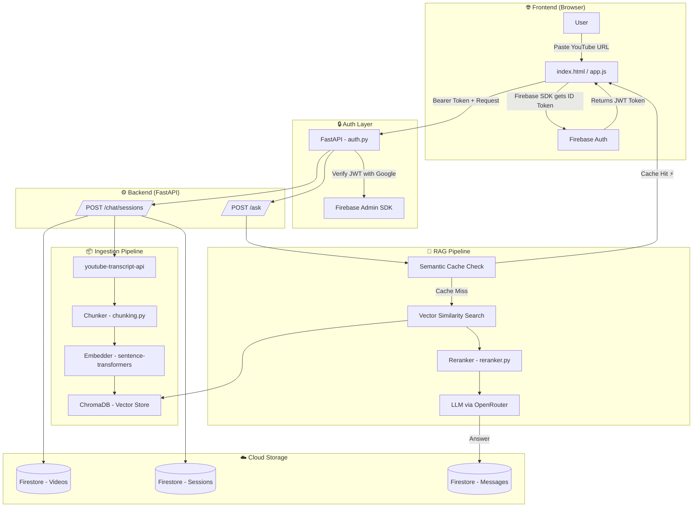
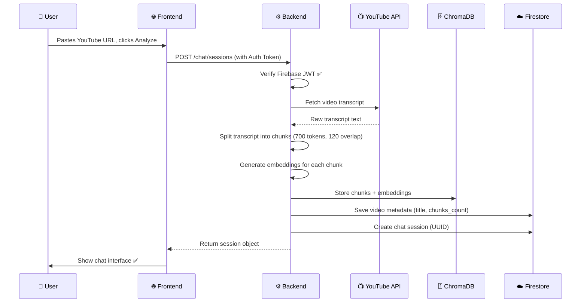
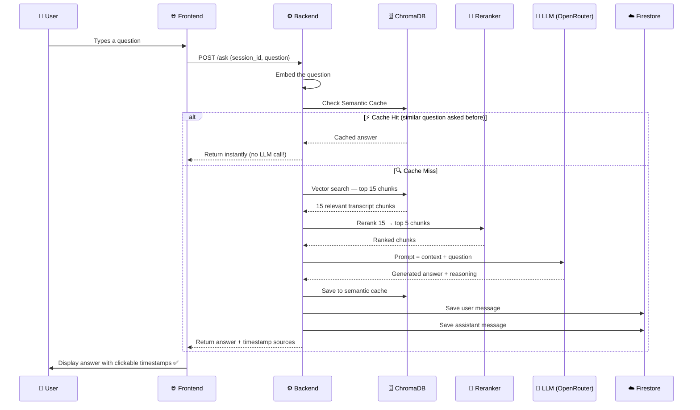
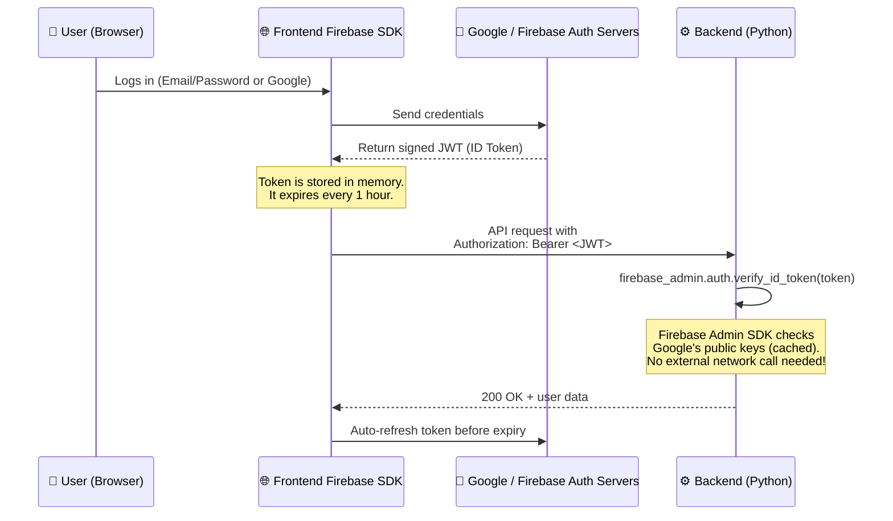

<div align="center">


# 🎬 YT-Assistant — AI Video Chat

> **Chat with any YouTube video using AI.** Paste a URL, ask a question, and get accurate answers backed by timestamps from the actual transcript.

</div>

---

## ✨ What Is This?

YT-Assistant is a **RAG-powered** (Retrieval-Augmented Generation) AI application that lets you have full conversations with YouTube video content. Instead of watching an hour-long video, you ask questions and the AI retrieves the exact parts of the transcript that answer them — complete with clickable timestamps.

- 🔐 **Secure:** Every user has isolated data via Firebase Authentication
- 🧠 **Intelligent:** Uses vector similarity search + a reranker for high-precision answers
- ⚡ **Fast:** Semantic caching avoids redundant LLM calls
- 🗂️ **Persistent:** Chat history is saved to Firestore and accessible any time

---

## 📐 Architecture Overview



---

## 🌊 Request Flow — Step by Step

### 1️⃣ Video Ingestion



### 2️⃣ Asking a Question (RAG Pipeline)



---

## 🧠 Core Concepts Explained

> **Don't know some terms? No problem — everything is explained here.**

### 🔷 RAG — Retrieval-Augmented Generation

An LLM (like GPT-4) has general world knowledge but has never seen your specific YouTube video. **RAG** is a design pattern that solves this:

1. **Retrieve** — find the most relevant passages from the video transcript
2. **Augment** — add those passages as context to your prompt
3. **Generate** — the LLM answers using only what you provided

This eliminates hallucinations because the model is restricted to provided context only.

---

### 🔷 Embeddings

A word like "happy" and "joyful" mean the same thing but look completely different to a computer doing keyword search. **Embeddings** convert sentences into lists of numbers (vectors) where *similar meanings produce similar numbers*.

```
"The dog ran fast"      → [0.21, -0.84, 0.12, ...]  ←─ close together
"The canine sprinted"   → [0.19, -0.81, 0.14, ...]  ←─ in vector space
"Stock market crashed"  → [-0.67, 0.33, -0.91, ...] ←─ far away
```

This project uses the `sentence-transformers` library to generate embeddings locally (free, no API cost).

---

### 🔷 Vector Database (ChromaDB)

ChromaDB stores embeddings and lets you query by mathematical distance instead of keyword matching. When you ask a question, your question is also embedded and ChromaDB finds the transcript chunks whose vectors are *closest* to yours in meaning.

```
Your Question Embedding ────→ ChromaDB searches nearest vectors
                                    │
                                    ▼
                          [Chunk 3] [Chunk 7] [Chunk 12] ...top 15 matches
```

---

### 🔷 Semantic Caching

Traditional caches are exact-match: `"What is X?" ≠ "Can you explain X?"`. Semantic caching uses embeddings to detect that these two questions mean the same thing and returns the previously generated answer instantly — saving LLM API costs.

---

### 🔷 Reranker

The vector search retrieves 15 candidates quickly but may include false positives. The reranker (a cross-encoder model) reads each `(question, chunk)` pair holistically and gives it a precise relevance score. Only the top 5 survive.

```
Vector Search (fast, approximate)  → 15 chunks
         ↓
Reranker (slow, precise)           → top 5 chunks
         ↓
LLM Prompt
```

---

## 🔒 Authentication Deep Dive

### How Firebase Auth Works

Firebase Authentication is a managed identity service. Instead of building login from scratch (which is a security minefield), we delegate all identity verification to Google.



### Where the Code Is

**Frontend `app.js`:**
```javascript
// Get the current user's token before every API call
async function getAuthHeaders() {
    const token = await currentUser.getIdToken(); // auto-refreshes if expired
    return { 'Authorization': `Bearer ${token}` };
}
```

**Backend `auth.py`:**
```python
def get_current_user(credentials_data = Depends(security)) -> dict:
    token = credentials_data.credentials
    decoded_token = auth.verify_id_token(token)  # throws if invalid/expired
    return { "uid": decoded_token["uid"], "email": decoded_token.get("email") }
```

Every protected route uses `current_user: dict = Depends(get_current_user)` — FastAPI automatically runs this check before the route function executes.

---

## ☁️ Firestore Database Deep Dive

Firestore is a NoSQL document database. Data is organized as **Collections → Documents → Subcollections**.

### Data Schema

```
Firestore Root
│
└── 📁 users  (Collection)
    │
    └── 📄 {USER_ID}  (Document — one per user)
        │
        ├── 📁 videos  (Subcollection)
        │   └── 📄 {VIDEO_ID}
        │       ├── video_id: "dQw4w9WgXcQ"
        │       ├── title: "Never Gonna Give You Up"
        │       ├── youtube_url: "https://..."
        │       ├── chunks_count: 42
        │       ├── processing_status: "completed"
        │       ├── created_at: "2026-05-26T..."
        │       └── updated_at: "2026-05-26T..."
        │
        └── 📁 chat_sessions  (Subcollection)
            └── 📄 {SESSION_UUID}
                ├── id: "3f1a-..."
                ├── video_id: "dQw4w9WgXcQ"
                ├── video_title: "Never Gonna Give You Up"
                ├── title: "What does the chorus say?"  ← auto-named from first message
                ├── chunks_count: 42
                ├── created_at: "2026-05-26T..."
                ├── updated_at: "2026-05-26T..."
                │
                └── 📁 messages  (Subcollection)
                    ├── 📄 {MSG_UUID}
                    │   ├── role: "user"
                    │   └── content: "What does the chorus say?"
                    └── 📄 {MSG_UUID}
                        ├── role: "assistant"
                        └── content: "The chorus says..."
```

**Security advantage:** Since all data is nested under `users/{USER_ID}`, a user can only ever query their own subtree. There is no risk of leaking another user's data — it's structurally impossible.

---

## 📁 Project Structure

```
YT-Assistant/
├── 📄 Dockerfile              ← Docker build instructions
├── 📄 .dockerignore           ← Files excluded from Docker build
├── 📄 README.md
│
├── 📁 backend/
│   ├── 📄 requirements.txt   ← Python dependencies
│   ├── 📄 .env               ← Secrets (never commit this!)
│   ├── 📄 firebase-service-account.json  ← Firebase credentials
│   └── 📁 app/
│       ├── 📄 main.py         ← FastAPI routes & app setup
│       ├── 📄 auth.py         ← Firebase JWT verification
│       ├── 📄 firestore_db.py ← All Firestore database functions
│       ├── 📄 transcript.py   ← YouTube transcript fetching
│       ├── 📄 chunking.py     ← Text splitting logic
│       ├── 📄 embeddings.py   ← Sentence-transformer embeddings
│       ├── 📄 vector_store.py ← ChromaDB read/write operations
│       ├── 📄 reranker.py     ← Cross-encoder reranking
│       ├── 📄 rag.py          ← Full RAG pipeline orchestration
│       ├── 📄 semantic_cache.py ← Semantic answer caching
│       └── 📄 retry_utils.py  ← Retry logic for external calls
│
└── 📁 frontend/
    ├── 📄 index.html          ← Main chat page
    ├── 📄 login.html          ← Login / signup page
    ├── 📄 app.js              ← Main app logic
    ├── 📄 login.js            ← Auth UI logic
    └── 📄 style.css           ← All styles
```

---

## 🚀 Running the Project

### Method 1: Direct / Local Setup

**Prerequisites:** [Miniconda](https://docs.anaconda.com/free/miniconda/index.html) or Anaconda, Git

**Step 1: Clone the repository**
```bash
git clone https://github.com/your-username/YT-Assistant.git
cd YT-Assistant
```

**Step 2: Create the Conda environment**
```bash
# This reads backend/environment.yml and installs all dependencies
conda env create -f backend/environment.yml

# Activate it:
conda activate yt-assistant
```

**Step 3: Configure environment variables**

Create a `.env` file inside the `backend/` folder:
```env
OPENROUTER_API_KEY=sk-or-v1-your-key-here
OPENROUTER_SITE_URL=http://localhost:8000
OPENROUTER_APP_NAME=YT-Assistant
OPENROUTER_CHAT_MODEL=openai/gpt-4o-mini

FIREBASE_SERVICE_ACCOUNT_PATH=firebase-service-account.json
```

Also place your `firebase-service-account.json` file inside `backend/`.

**Step 4: Run the server**
```bash
cd backend
uvicorn app.main:app --reload
```

Open your browser at **http://127.0.0.1:8000** ✅

---

### Method 2: Docker

**Prerequisites:** [Docker Desktop](https://www.docker.com/products/docker-desktop/) installed and running.

**Step 1: Clone the repository**
```bash
git clone https://github.com/your-username/YT-Assistant.git
cd YT-Assistant
```

**Step 2: Add your secrets**

Place your `firebase-service-account.json` inside `backend/`.

Create `backend/.env`:
```env
OPENROUTER_API_KEY=sk-or-v1-your-key-here
OPENROUTER_SITE_URL=http://localhost:8000
OPENROUTER_APP_NAME=YT-Assistant
OPENROUTER_CHAT_MODEL=openai/gpt-4o-mini
FIREBASE_SERVICE_ACCOUNT_PATH=firebase-service-account.json
```

**Step 3: Build the Docker image**
```bash
docker build -t yt-assistant .
```

> This installs all conda dependencies inside a portable container. Takes ~3-5 min the first time (downloading ML models), then uses cache on rebuilds.

**Step 4: Run the container**
```bash
docker run -d \
  --name yt-assistant \
  -p 8000:8000 \
  -v "$(pwd)/backend/.env:/app/backend/.env" \
  -v "$(pwd)/backend/firebase-service-account.json:/app/backend/firebase-service-account.json" \
  -v "$(pwd)/backend/chroma_db:/app/backend/chroma_db" \
  yt-assistant
```

> **What these flags do:**
> - `-d` — run in background (detached)
> - `-p 8000:8000` — expose the app on your localhost port 8000
> - `-v .env:/app/backend/.env` — mount your secrets file (never bake secrets into the image!)
> - `-v chroma_db:/app/backend/chroma_db` — persist your vector DB data between container restarts

**On Windows PowerShell** (replace `$(pwd)` with `${PWD}`):
```powershell
docker run -d `
  --name yt-assistant `
  -p 8000:8000 `
  -v "${PWD}/backend/.env:/app/backend/.env" `
  -v "${PWD}/backend/firebase-service-account.json:/app/backend/firebase-service-account.json" `
  -v "${PWD}/backend/chroma_db:/app/backend/chroma_db" `
  yt-assistant
```

Open your browser at **http://localhost:8000** ✅

**Useful Docker commands:**
```bash
docker logs yt-assistant          # View server logs
docker stop yt-assistant          # Stop the container
docker start yt-assistant         # Start it again
docker rm yt-assistant            # Remove the container
```

---

### The Dockerfile Explained

```dockerfile
FROM continuumio/miniconda3:24.4.0-0
# We use Miniconda because ML packages (PyTorch, SciPy) install much more 
# cleanly and reliably through conda-forge than through standard pip.

ENV PYTHONDONTWRITEBYTECODE=1 PYTHONUNBUFFERED=1
# PYTHONDONTWRITEBYTECODE: Don't write .pyc files (useless in containers).
# PYTHONUNBUFFERED: Print logs immediately instead of buffering them.

ENV CONDA_ENV_NAME=yt-assistant \
    PATH=/opt/conda/envs/yt-assistant/bin:$PATH
# By prepending the conda environment's bin folder to the PATH, 
# Docker will automatically use our conda Python instead of the system Python.

COPY backend/environment.yml /app/backend/environment.yml
RUN conda env create -f /app/backend/environment.yml && conda clean -afy
# IMPORTANT: Copy the environment.yml BEFORE the full source code.
# Docker caches each layer. If the dependencies didn't change,
# Docker skips conda install entirely on subsequent builds — saving minutes.
# `conda clean -afy` deletes temporary installer files to keep the image small.

COPY . /app
# Copy source code AFTER installing dependencies so code changes don't bust the cache.

CMD ["uvicorn", "app.main:app", "--host", "0.0.0.0", "--port", "8000"]
# 0.0.0.0 means "listen on all network interfaces" — required inside Docker
# so the container can receive traffic from the outside world.
```

---

## ⚙️ Environment Variables Reference

| Variable | Required | Description |
|---|---|---|
| `OPENROUTER_API_KEY` | ✅ Yes | Your OpenRouter API key for LLM access |
| `FIREBASE_SERVICE_ACCOUNT_PATH` | ✅ Yes | Path to your Firebase service account JSON |
| `OPENROUTER_CHAT_MODEL` | Optional | LLM model to use (default: `openai/gpt-4o-mini`) |
| `OPENROUTER_SITE_URL` | Optional | Your app's URL for OpenRouter headers |
| `OPENROUTER_APP_NAME` | Optional | Your app's name for OpenRouter headers |

---

## 🔑 Getting Your API Keys

### OpenRouter API Key
1. Go to [openrouter.ai](https://openrouter.ai)
2. Sign up / log in
3. Navigate to **Keys** → **Create Key**
4. Copy the key starting with `sk-or-v1-...`

### Firebase Service Account
1. Go to the [Firebase Console](https://console.firebase.google.com)
2. Select your project → ⚙️ **Project Settings**
3. Go to **Service Accounts** tab
4. Click **Generate new private key**
5. Save the downloaded JSON as `backend/firebase-service-account.json`

---

<div align="center">
  <p>Built with ❤️ using FastAPI, ChromaDB, Firebase & OpenRouter</p>
</div>
